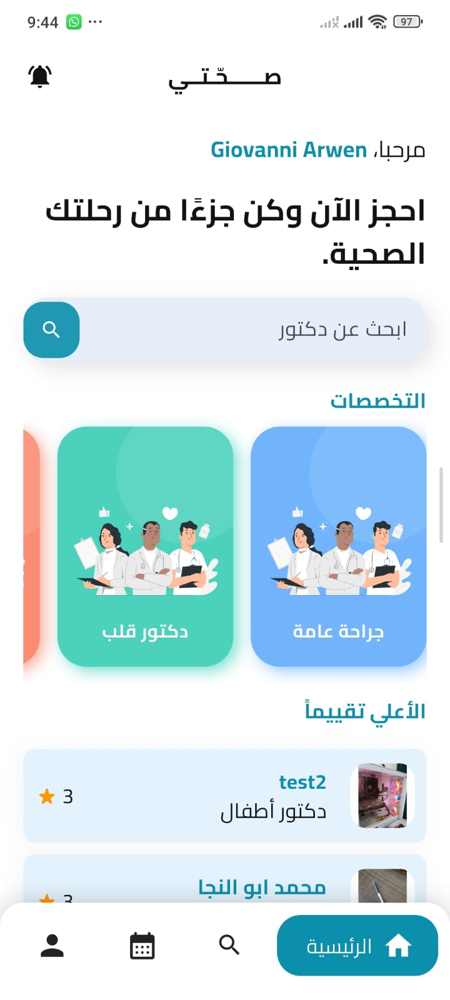

# 🏥 Se7ety - Healthcare Appointment Booking App

Se7ety is a scalable healthcare mobile application built using Flutter and Firebase.  
The app allows patients to book appointments with doctors across multiple medical specialties, with secure authentication and role-based access control.

---

## 🚀 Features

- 🔐 Secure Authentication using Firebase & Google Sign-In
- 👨‍⚕️ Role-Based Access (Doctor / Patient)
- 📅 Real-time Appointment Booking
- 🏥 Browse Doctors by Specialization
- 👤 Profile Management with Image Upload
- 🌍 Arabic Language Support
- 🎨 Clean & Responsive UI Design
- ☁️ Cloudinary Integration for Media Management
- 🧠 BLoC State Management Architecture

---

## 🛠 Tech Stack

- **Flutter**
- **Dart**
- **BLoC (State Management)**
- **Firebase Authentication**
- **Cloud Firestore**
- **Google Sign-In**
- **Cloudinary**
- **Clean Architecture Principles**

---

## 🏗 Architecture

The project follows a structured architecture using:

- BLoC Pattern for state management
- Separation of Concerns
- Modular feature-based structure
- Real-time data handling with Firestore

---

## 📸 Screenshots

### 🏠 Home Screen


### 🔐 Login Screen


### 👨‍⚕️ Doctor Profile


### 📅 Booking Screen

---

## 📦 Installation

```bash
git clone https://github.com/GiovanniArwen/se7ety_gio.git
cd se7ety_gio
flutter pub get
flutter run
